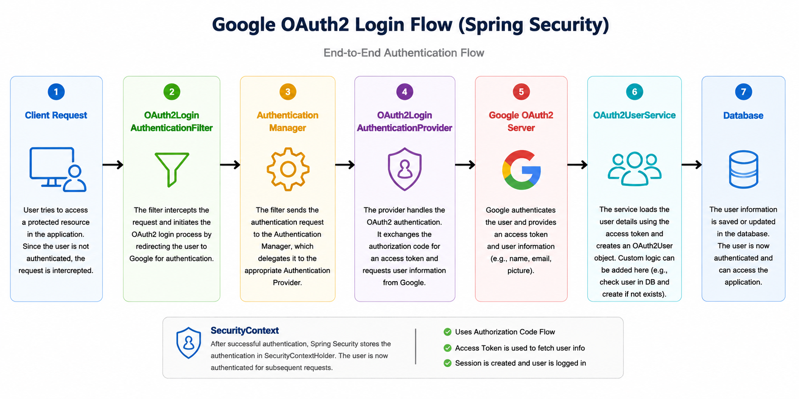
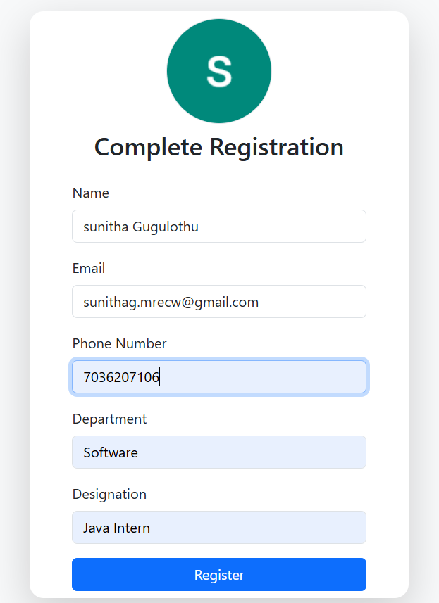
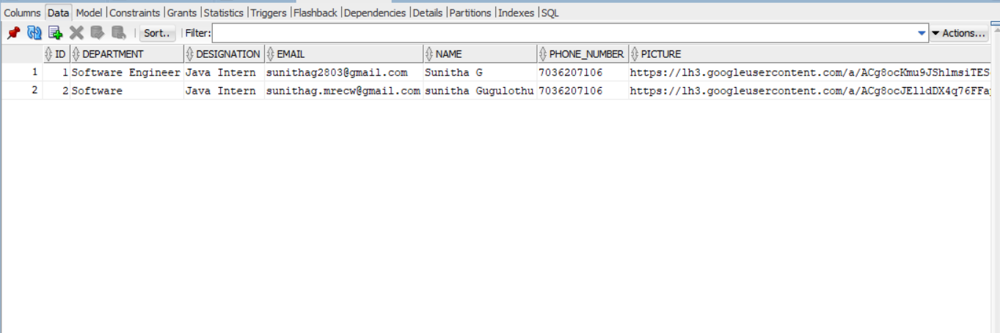

1. Deliverables
2. Working application (GitHub repository link)

3.https://github.com/sunithag-w/google-oauth2login-sso 

4. OAUTH2 FLOW

5. 

6. Google OAuth2 Authentication Flow Through SecurityFilterChain

The following diagram illustrates the end-to-end Google OAuth2 authentication flow implemented using Spring Security, from the initial client request to user authentication and database persistence.

* When the user clicks Continue with Google, Spring Security starts the OAuth2 authorization flow.
* The OAuth2 login filter redirects the browser to Google's authorization endpoint with the client ID, redirect URI, scopes, response type, and state. 
* Google authenticates the user and redirects back to our application with an authorization code. 
* The OAuth2 login filter processes this callback and passes the authentication request to the AuthenticationManager.
* The AuthenticationManager delegates it to the OAuth2LoginAuthenticationProvider because this is an OAuth2 authentication request.
* The provider exchanges the authorization code with Google's token endpoint and receives an access token.
* The OAuth2UserService then uses that access token to call Google's UserInfo endpoint and obtain the user's details such as email, name, and picture.
* Spring converts this into an OAuth2User, and after successful authentication the authentication is stored in the SecurityContext.
* Our application can then check the user's email in our database and create or update the application user if necessary.

7. **Screenshots of the complete flow **:

8. Landing Page

  Provides the Continue with Google button.

 

9. Google Login Consent Page

 

10. Registration form (new user)

 Displays the Google user's name, email and profile picture and collects:
    1.Phone Number
    2.Department
    3.Designation

  

11. Profile page

Displays the registered user Details:
1.Profile Picture
2.Name
3.Email
4.Phone Number
5.Department
6.Designation
7.Task List

 

12. Logout back to Landing Page

 

13. ===Short README Explaining===

14. *Detecting Whether the user is new or existing *

15. User opens the Application.
16. User clicks CONTINUE WITH GOOGLE.
17. Google authenticates the user.
18. After successful authentication, the application gets the user's name, email and profile picture.
19. The application checks the user's email in the database.
20. If the email already exists, the user is redirected to the Profile page.
21. If the email does not exist, the user is redirected to the Registration page.
22. The new user enters:
   - Phone Number
   - Department
   - Designation
23. The user information is saved in the database.
24. After successful registration, the user is redirected to the Profile page.
25. The user can logout and return to the landing page.

SO,

26. Existing User: If the email is already present in the database, the application considers the user an existing user and redirects the user to the Profile page.

27. New User: If the email is not present in the database, the application considers the user a new user and redirects the user to the Registration page.
The user then provides the additional required information and the application saves the user in the database.

28.*Database Table Design *

The application stores user information in the USER_DATA table.

                  Column	                                                           Description
                  ID	                                                                Primary key
                  NAME	                                                              Username received from Google
                  EMAIL	                                                              User email received from Google
                  PICTURE	                                                            Google profile picture
                  PHONE_NUMBER	                                                      User phone number
                  DEPARTMENT	                                                        User department
                  DESIGNATION	                                                        User designation

   Database Structure

   
   

  The email is used to check whether the user is already registered or not. 

  29.*Security *

   Google OAuth2 is used for authentication.
   The Google Client ID and Client Secret are stored using environment variables and are not hardcoded in the source code.

    Example:
       properties
          spring.security.oauth2.client.registration.google.client-id=${GOOGLE_CLIENT_ID}
          spring.security.oauth2.client.registration.google.client-secret=${GOOGLE_CLIENT_SECRET}

          

