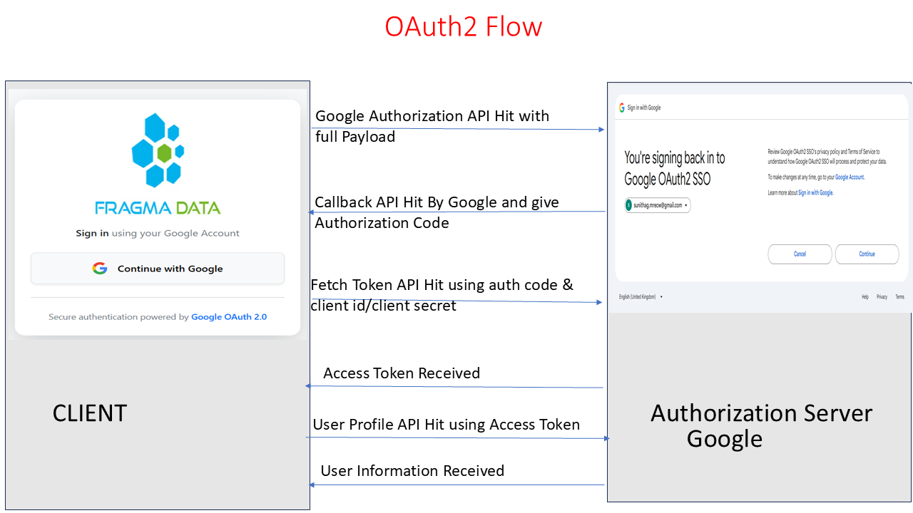
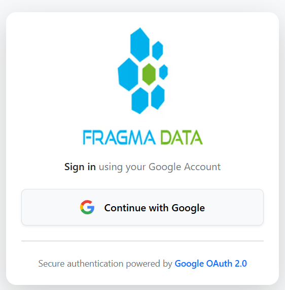
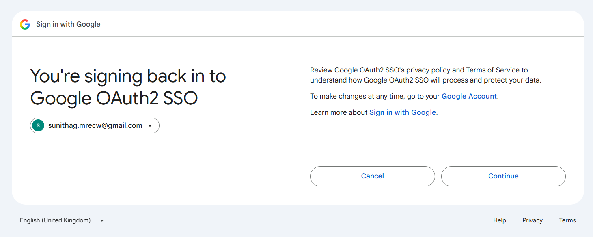
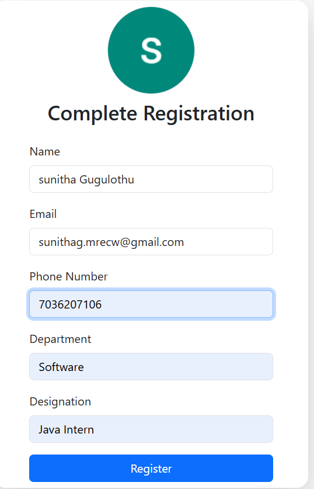
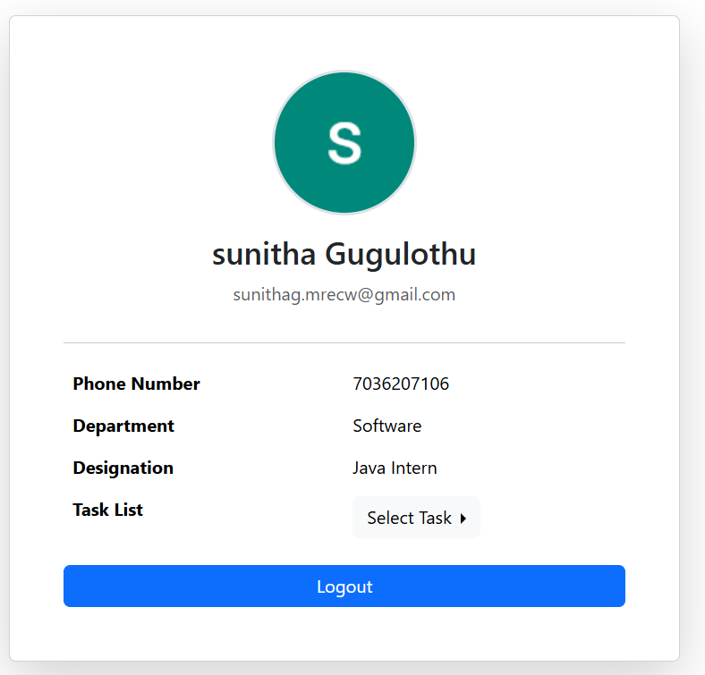

1. Deliverables
2. Working application (GitHub repository link)

  3.https://github.com/sunithag-w/google-oauth2login-sso 

4. OAUTH2 FLOW

5. 

6. Complete Flow Of OAuth2Login

7. Screenshots of the complete flow:

8. Landing Page

Provides the Continue with Google button.

9. 

10. Google Login Consent Page

11. 

12. Registration form (new user)

 Displays the Google user's name, email and profile picture and collects:
    1.Phone Number
    2.Department
    3.Designation

 13. 

14. Profile page

Displays the registered user Details:
1.Profile Picture
2.Name
3.Email
4.Phone Number
5.Department
6.Designation
7.Task List

15. 

16. Logout back to Landing Page

17. 

18. ===Short README Explaining===

19.  Application Flow

1. User opens the Application.
2. User clicks CONTINUE WITH GOOGLE.
3. Google authenticates the user.
4. After successful authentication, the application gets the user's name, email and profile picture.
5. The application checks the user's email in the database.
6. If the email already exists, the user is redirected to the Profile page.
7. If the email does not exist, the user is redirected to the Registration page.
8. The new user enters:
   - Phone Number
   - Department
   - Designation
9. The user information is saved in the database.
10. After successful registration, the user is redirected to the Profile page.
11. The user can logout and return to the landing page.

12. Detecting Whether the user is new or existing

13. Existing User
If the email is already present in the database, the application considers the user an existing user and redirects the user to the Profile page.

14. New User
If the email is not present in the database, the application considers the user a new user and redirects the user to the Registration page.
The user then provides the additional required information and the application saves the user in the database.

20. Database Table Design

The application stores user information in the USER_DATA table.

                  Column	                                                           Description
                  ID	                                                                Primary key
                  NAME	                                                              Username received from Google
                  EMAIL	                                                              User email received from Google
                  PICTURE	                                                            Google profile picture
                  PHONE_NUMBER	                                                      User phone number
                  DEPARTMENT	                                                        User department
                  DESIGNATION	                                                        User designation

  The email is used to check whether the user is already registered or not. 

  21.Security

   Google OAuth2 is used for authentication.
   The Google Client ID and Client Secret are stored using environment variables and are not hardcoded in the source code.

    Example:
       properties
          spring.security.oauth2.client.registration.google.client-id=${GOOGLE_CLIENT_ID}
          spring.security.oauth2.client.registration.google.client-secret=${GOOGLE_CLIENT_SECRET}

          

